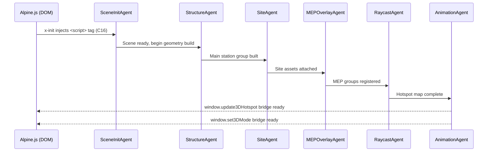

# Multi-Agent Implementation Plan — Bharati 3D Digital Twin

> **Version:** 2.0 (Deep Analysis Revision)  
> **Authority:** Recalibrated from complete reading of all 29 documents in `docs/bharati3d/`  
> **Reference:** `docs/bharati3d/05-subagent_synthesis.md` (full architectural context)  
> **Constraint Compliance:** C1, C7, C10, C11, C13, C14, C16, C17  
> **Target File:** `app/static/js/three/station_3d_view.js` (lazy-loaded, never in base template)

---

## Overview

The Bharati 3D Digital Twin consists of a **single lazy-loaded JavaScript module** (`station_3d_view.js`) that constructs the station scene procedurally — no external GLB required. A multi-agent pipeline decomposes the implementation into six independent, sequentially ordered sub-agents. Each agent has precisely scoped inputs, outputs, and success criteria drawn directly from the architectural specifications.



---

## Sub-Agent Responsibilities

---

### Agent 1 — `SceneInitAgent`
**Scope:** Scene bootstrap, renderer, camera, lighting, and mode controller.

**Inputs:** Container DOM element ID.  
**Outputs:** Populated `{ scene, camera, renderer, clock, orbitControls }` object passed to subsequent agents.

#### 1.1 Renderer Setup
```javascript
const renderer = new THREE.WebGLRenderer({ antialias: true, alpha: true });
renderer.setPixelRatio(Math.min(window.devicePixelRatio, 2)); // cap at 2× for performance
renderer.shadowMap.enabled = true;
renderer.shadowMap.type = THREE.PCFSoftShadowMap;
renderer.toneMapping = THREE.ACESFilmicToneMapping; // needed for bloom/night modes
renderer.toneMappingExposure = 1.2;
```

#### 1.2 Camera Setup
```javascript
const camera = new THREE.PerspectiveCamera(45, w/h, 1, 2000);
camera.position.set(120, 90, 160); // NE oblique default view
```
- OrbitControls damping: 0.05, maxPolarAngle: `Math.PI/2 - 0.05`, target: `(0, 6, 0)`

#### 1.3 Lighting
| Light | Type | Color | Intensity | Position | Purpose |
|:---|:---|:---|:---:|:---|:---|
| Ambient | AmbientLight | `#1A312C` | 2.0 | — | Brand deep green base fill |
| Main Sun | DirectionalLight | `#7DBFAD` | 1.5 | `[50, 100, 50]` | Shadow-casting polar sun |
| Back Fill | DirectionalLight | `#428475` | 1.0 | `[-50, 50, -50]` | Brand teal backlight |
| Fog | FogExp2 | `#0B1C18` | density: 0.004 | — | Depth + blizzard atmosphere |

Night mode lighting (swapped in via `setLightingMode('night')`):
- Ambient: `#1A2B3C` intensity 0.35
- Moonlight: `#6B8BA4` intensity 0.45 from `[0, 80, -30]`
- Aurora ambient: `#2A6A4E` intensity 0.45
- Aurora directional: `#4EBA87` intensity 0.65 from `[0, 50, -20]`

#### 1.4 Mode Controller (Global Bridge)
```javascript
window.set3DMode = function(mode) {
  // Modes: 'exterior' | 'xray' | 'core_only' | 'hvac' | 'thermal' | 'structural' | 'night'
  // Dispatches visibility changes to all agent groups
};
```

**Success Criteria:**
- [ ] Renderer attached to container, no console errors
- [ ] OrbitControls functional; camera cannot orbit below bedrock
- [ ] `window.set3DMode` exists and responds to all 7 modes

---

### Agent 2 — `StructureAgent`
**Scope:** Main station geometry — stilts, hull shell, interior container core, penthouse, windows, stairs, flag.  
**Inputs:** `scene`, shared material library.  
**Outputs:** `stationGroup` (THREE.Group), material refs.

#### 2.1 Material Library (shared across all agents)
All materials must be created once and stored in `window._bm = {}`:
```javascript
window._bm = {
  hull:       new THREE.MeshStandardMaterial({ color: 0xBAC4C7, roughness: 0.28, metalness: 0.80, clearcoat: 0.20 }),
  roof:       new THREE.MeshStandardMaterial({ color: 0x4F6D7A, roughness: 0.35, metalness: 0.85 }),
  keel:       new THREE.MeshStandardMaterial({ color: 0x8E9EA4, roughness: 0.45, metalness: 0.70 }),
  glazingDay: new THREE.MeshPhysicalMaterial({ color: 0x1A312C, roughness: 0.05, transmission: 0.85, ior: 1.52, thickness: 0.5 }),
  winWarm:    new THREE.MeshStandardMaterial({ color: 0xFFAE33, emissive: 0xFF9900, emissiveIntensity: 2.0 }),
  winLab:     new THREE.MeshStandardMaterial({ color: 0xE6F2FF, emissive: 0xC8E2FF, emissiveIntensity: 1.8 }),
  vstilt:     new THREE.MeshStandardMaterial({ color: 0xB0BFC5, roughness: 0.25, metalness: 0.85 }),
  stairs:     new THREE.MeshStandardMaterial({ color: 0xCFD8DC, roughness: 0.40, metalness: 0.90 }),
  concrete:   new THREE.MeshStandardMaterial({ color: 0x6D6B66, roughness: 0.80, metalness: 0.05 }),
  ctnGreen:   new THREE.MeshStandardMaterial({ color: 0x5C9E68, roughness: 0.70, metalness: 0.20 }),
  ctnWhite:   new THREE.MeshStandardMaterial({ color: 0xDCE4E4, roughness: 0.70, metalness: 0.20 }),
  ctnOrange:  new THREE.MeshStandardMaterial({ color: 0xC85A32, roughness: 0.70, metalness: 0.20 }),
};
```

#### 2.2 Substructure — Vertical Stilts (InstancedMesh)
- 28 cylindrical stilts, `CylinderGeometry(0.2, 0.2, H, 8)` where H varies by axis position
- Grid: longitudinal spacing 4.8 m, transverse from ±4.8 m to ±8.4 m
- 28 concrete footing pads: flat `CylinderGeometry(0.6, 0.6, 0.2, 8)` at Y=0
- Knee braces: `CylinderGeometry(0.08, 0.08, 2.8, 6)` at 45°, merged as one BufferGeometry

#### 2.3 Quad V-Stilts (from `createVStiltBent()` in doc 11)
Use the procedural generator from `11_cantilever_v_stilts_and_underbelly_aerodynamics.md`:
```javascript
function createVStiltBent(topWidth, bottomWidth, height, legThickness) {
  // CylinderGeometry with 4 radial segments = tapered box section effect
  // left leg: rotation.z = +atan2(topWidth*0.25, height)
  // right leg: rotation.z = -atan2(topWidth*0.25, height)
}
// Deploy 4 bents:
// Outer port:      position [18.5, 1.05, +8.75],  topWidth=8.75
// Outer starboard: position [18.5, 1.05, -8.75],  topWidth=8.75
// Inner port:      position [14.0, 1.05, +4.80],  topWidth=4.80
// Inner starboard: position [14.0, 1.05, -4.80],  topWidth=4.80
```
Name the group: `hotspot-v-stilts`

#### 2.4 Main Hull Shell
Use the **exact transverse profile vertices** from `17_front_prow_cad_elevation_and_datums.md`:
```javascript
const hullProfile = new THREE.Shape();
// P1→P11 symmetric shape (see doc 17 §3 vertex table)
hullProfile.moveTo(0,    2.60);  // keel centre
hullProfile.lineTo(7.5,  3.40);  // port stilt haunch
hullProfile.lineTo(10.0, 5.10);  // widest chine (H2)
hullProfile.lineTo(9.5,  8.95);  // roof fascia (H3)
hullProfile.lineTo(5.0,  10.10); // hipped roof ridge
hullProfile.lineTo(3.8,  11.58); // penthouse apex port (H4)
// Mirror for starboard and close shape
```
Extrude this profile 50.0 m along X-axis (from x=−25 to x=+25):
- `bevelEnabled: false` — exact CAD profile
- Apply `AluminumFasciaMat` to side faces, `RoofPanelMat` to roof face
- Cut out the window ribbon slot: Y +7.8 → +9.0 (height 1.2 m, recessed 0.15 m)
- Group name: `hotspot-main-hab`

#### 2.5 Cantilevered Prow Glazing (6-bay panoramic)
Using longitudinal profile from `04_front_oblique_facade_and_v_stilts.md`:
```javascript
const prowProfile = new THREE.Shape();
prowProfile.moveTo(0, 0);      // rear underbelly anchor
prowProfile.lineTo(10.0, 1.2); // upward sloped underbelly
prowProfile.lineTo(11.0, 4.2); // inward raked 15° window base
prowProfile.lineTo(10.5, 4.6); // top roof chamfer bevel
prowProfile.lineTo(0, 4.6);    // roof deck line
```
- Extrude along Z-axis 20.0 m (full prow width)
- Front face gets `ProwGlazingDay` material (or `NightWindowWarm` in night mode)
- 6 bay mullions: 5× `BoxGeometry(0.10, 3.0, 0.25)` at Z intervals
- Position at x=+24 (prow tip)

#### 2.6 Penthouse Module
- `BoxGeometry(15.0, 2.8, 7.5)` centred at `[0.0, 10.34, 0.0]`
- Railing: 4× thin `BoxGeometry(L, 0.05, 0.05)` strips at Y=11.58+1.1 around perimeter
- 3× exhaust flues: `CylinderGeometry(0.15, 0.15, 1.2, 8)` at x≈−9.6, Y=+12.5, Z=+3.5

#### 2.7 Access Stairs (×2, symmetrical)
- Port staircase: `[18.0, 2.3, +9.5]`, 13 steps, rise 0.18 m, tread 0.28 m, slope 32.7°
- Starboard staircase: `[18.0, 2.3, -9.5]`
- Each step: `BoxGeometry(0.28, 0.18, 1.2)`, merged into single geometry per flight
- Handrails: thin cylinder array

#### 2.8 Corner Chamfer Bevels
- 4× planar panels, 45°, face width 1.2 m
- Applied at all four longitudinal corners of the hull

#### 2.9 Container Core (X-Ray Layer)
- `Level0_Utility_Block`: `BoxGeometry(24.0, 3.8, 20.0)` at `[-12.0, 2.8, 0.0]`, `ctnOrange`
- `Level1_Living_Deck`: `BoxGeometry(48.0, 3.0, 20.0)` at `[0.0, 6.5, 0.0]` with two material zones (green N, white S)
- `Level2_Penthouse`: `BoxGeometry(15.0, 2.5, 7.5)` at `[0.0, 9.8, 0.0]`, `ctnWhite`
- Group hidden by default; visible in `xray` and `core_only` modes

#### 2.10 Indian Flag Emblem
- `THREE.DecalGeometry` at `[0.0, 5.0, -10.1]`, size `(1.8, 1.2, 0.1)`
- Texture map with saffron/white/green tricolor and Ashoka Chakra

**Performance Budget:** ≤ 8,000 triangles total for all of Agent 2.

**Success Criteria:**
- [ ] Hull correctly extrudes the verified transverse profile (P1–P11)
- [ ] 4 V-stilt bents placed at correct world coordinates
- [ ] Window ribbon geometry recessed 0.15 m
- [ ] Container core toggles correctly with mode controller
- [ ] All hotspot group names set with `hotspot-` prefix

---

### Agent 3 — `SiteAgent`
**Scope:** All exterior site assets beyond the main building.  
**Inputs:** `scene`, material library.  
**Outputs:** Named hotspot groups for all exterior elements.

#### 3.1 SATCOM Geodesic Radome
```javascript
const radomeGeo = new THREE.IcosahedronGeometry(5.2, 2); // 80 faces
const radomeMat = new THREE.MeshStandardMaterial({
  color: 0xE6EDED, roughness: 0.35, metalness: 0.05, flatShading: true
});
const radomeMesh = new THREE.Mesh(radomeGeo, radomeMat);
radomeMesh.position.set(-25.0, 7.2, 35.0);
```
- Ring truss base: `CylinderGeometry(5.0, 5.0, 0.3, 32)` at Y=2.0
- 10 support stilts: `InstancedMesh` of thin cylinders
- Group name: `hotspot-satcom`

#### 3.2 Fuel Farm (13 tanks)
```javascript
const tankGeo = new THREE.CylinderGeometry(2.5, 2.5, 8, 16);
const fuelIM = new THREE.InstancedMesh(tankGeo, darkSlateMat, 13);
// Arrange in 3 rows at [-80, 4, -35] base, 5m apart
```
- Group name: `hotspot-fuel-storage`
- Pipe connections: ExtrudeGeometry along curved paths between tanks and building

#### 3.3 Helipad
```javascript
// Main pad
new THREE.CylinderGeometry(15, 15, 0.5, 32) at [-85, 4, -95]
// "H" marking — 3 BoxGeometry strips
// Ring: RingGeometry(13, 13.5, 64)
```
- Group name: `hotspot-heliport`
- Windsock: `CylinderGeometry(0.15, 0.05, 1.5)` on pole at pad edge

#### 3.4 Container Depot (NW)
```javascript
const ctnGeo = new THREE.BoxGeometry(6.06, 2.59, 2.44);
const ctnIM = new THREE.InstancedMesh(ctnGeo, multiMat, 25);
// Colors: [0xE85D04, 0x008751, 0x0B4F6C, 0x8C3828] cycled
// Positioned around [-28, 0, -18] in 5×5 grid
```
- Group name: `hotspot-container-depot`

#### 3.5 Trace-Heated Pipe Rack
- `THREE.TubeGeometry` or `ExtrudeGeometry` along a CatmullRomCurve3 path from building to fuel farm
- Width: 1.2 m, A-frame supports every 6 m, 2 insulated pipes side-by-side
- Group name: `hotspot-pipe-rack`

#### 3.6 Flagpole Array (5×)
- 5× `CylinderGeometry(0.04, 0.04, 8, 6)` at `[-45, 0, -70]` spaced 3.0 m apart
- Group name: `hotspot-flagpole-ridge`

#### 3.7 Meteorological Mast
- `CylinderGeometry(0.06, 0.06, 5, 6)` at `[0, 13.5, 0]` (above penthouse)
- Antenna arms: thin horizontal cylinders
- Group name: `hotspot-meteo-mast`

#### 3.8 Meltwater Tarn
- `PlaneGeometry(60, 40)` at `[-35, -1.2, 0]`, rotated X=−90°
- Material: `TarnWaterMat` — `#1B4D72`, roughness 0.02, transmission 0.90
- Group name: `hotspot-meltwater-tarn`

#### 3.9 Terrain
```javascript
const terrainGeo = new THREE.PlaneGeometry(300, 300, 64, 64);
// Noise-displace vertices; station pad area at Y=0 (flatten radius ~30m)
// North slope: Y = -35 at Z = -350
terrainGeo.computeVertexNormals();
```
- Material: `GraniteBedrockMat` — `#826B50`, roughness 0.85, normal map

#### 3.10 Blizzard Particle System
```javascript
const particleCount = 3000;
// Distribute in [-150, 150] × [-10, 100] × [-150, 150]
// Primary drift: vx = +0.3 to +0.7, vy = -0.1 to -0.3, vz = ±0.1
// Reset when x > 150 or y < -10
// PointsMaterial: color #C8E6D7, size 0.8, blending: AdditiveBlending, opacity 0.6
```

**Success Criteria:**
- [ ] All 9 site asset groups have `hotspot-` prefixed names
- [ ] SATCOM radome uses IcosahedronGeometry with `flatShading: true`
- [ ] Fuel tanks use `InstancedMesh` (not individual meshes)
- [ ] Terrain has no flat plate artefacts in station pad area

---

### Agent 4 — `MEPOverlayAgent`
**Scope:** MEP system overlay meshes for SCADA inspection modes.  
**Inputs:** `scene`, MEP color constants.  
**Outputs:** `MEPGroup` with individually togglable sub-meshes.

All MEP meshes are **hidden by default** (`.visible = false`); shown only when the corresponding mode is active.

#### 4.1 Structural Frame (11 Portal Bents)
Using procedural generator from `16_container_cluster_and_exoskeleton_frame_integration.md`:
```javascript
function buildExoskeletonBents(bentProfileShape) {
  const bentGeo = new THREE.ExtrudeGeometry(bentProfileShape, { depth: 0.35, bevelEnabled: false });
  const steelMat = new THREE.MeshStandardMaterial({ color: 0x2B3A8C, metalness: 0.85, roughness: 0.30 });
  const bentsGroup = new THREE.Group();
  for (let i = 0; i < 11; i++) {
    const bent = new THREE.Mesh(bentGeo, steelMat);
    bent.position.x = -25.0 + (i * 4.8); // Axes 1→21
    bentsGroup.add(bent);
  }
  return bentsGroup; // name: 'StructuralFrameMesh'
}
```
Bent cross-section profile (from doc 16):
- Bottom haunch: slopes inward 30° (underbelly chamfer)
- Side girt: vertical, window pocket at Y +7.8→+9.0
- Roof rafter: slopes inward 15° (hipped roof chamfer)

#### 4.2 HVAC Supply Ducts (green `#27AE60`)
- Main trunk: `BoxGeometry(0.8, 0.5, 42.0)` centred at `[0, 9.0, 0]` (penthouse ceiling plenum)
- 24 branch drops: `CylinderGeometry(0.2, 0.2, 3.0)` descending into each cabin zone

#### 4.3 HVAC Return Ducts (yellow `#F1C40F`)
- Parallel to supply trunk, offset 1.0 m

#### 4.4 Hydronic Heating Loops (red `#E74C3C`)
- Primary supply: `TubeGeometry` radius 0.05 along underfloor perimeter path
- Secondary return: radius 0.04, `#C0392B` (lower temp burgundy)

#### 4.5 Domestic Water & Greywater (blue `#2980B9`)
- Thin tubes radius 0.025 from snow melter tank `[-16.8, 2.8, -7.2]` through building

#### 4.6 Electrical Busway (purple `#8E44AD`)
- 2× trays: `BoxGeometry(0.4, 0.1, 48.0)` running longitudinally above corridor ceiling

#### Toggle API
```javascript
function setMEPOverlay(systemName, isVisible) {
  const map = {
    'structural': 'StructuralFrameMesh',
    'hvac':       ['HVACSupplyMesh', 'HVACReturnMesh'],
    'thermal':    ['HydronicHeatMesh'],
    'water':      ['DomesticWaterMesh'],
    'electrical': ['ElectricalBuswayMesh'],
  };
  // Apply visibility to mapped mesh(es)
}
```

**Performance Budget:** ≤ 4,000 triangles (never rendered simultaneously with exterior mode).

**Success Criteria:**
- [ ] All MEP layers default to `.visible = false`
- [ ] `setMEPOverlay` correctly toggles each layer
- [ ] Colors match the taxonomy in doc 15 exactly
- [ ] Structural bents use 11 iterations at 4.8 m spacing

---

### Agent 5 — `RaycastAgent`
**Scope:** Raycasting, hover effects, click dispatch, and Alpine bridge.  
**Inputs:** `scene`, `camera`, `renderer`.  
**Outputs:** `window.update3DHotspot` bridge; `st-3d-click` CustomEvents.

#### 5.1 Hotspot Registry
Build the definitive hotspot map from `05-subagent_synthesis.md §6`:
```javascript
const HOTSPOT_REGISTRY = {
  'hotspot-power-plant':      { label: 'CHP Power Plant',        anchor: [-19.2, 2.8,  7.2] },
  'hotspot-hvac':             { label: 'HVAC Life Support',       anchor: [-7.2,  10.2, 0.0] },
  'hotspot-chp-heating':      { label: 'District Heating',        anchor: [-6.0,  3.2,  0.0] },
  'hotspot-water-lss':        { label: 'Water & LSS',             anchor: [-19.2, 2.8, -7.2] },
  'hotspot-workshop-garage':  { label: 'Vehicle Garage',          anchor: [-18.0, 3.8,  0.0] },
  'hotspot-main-hab':         { label: 'Main Habitat',            anchor: [0.0,   5.5,  0.0] },
  'hotspot-dining-mess':      { label: 'Dining Mess',             anchor: [-18.0, 6.5,  0.0] },
  'hotspot-medical-bay':      { label: 'Medical Bay',             anchor: [-14.4, 6.5, -7.2] },
  'hotspot-ocean-lounge':     { label: 'Ocean Lounge',            anchor: [19.0,  6.5,  0.0] },
  'hotspot-science-terrace':  { label: 'Science Terrace',         anchor: [2.0,   11.5, 0.0] },
  'hotspot-meteo-mast':       { label: 'Meteorological Mast',     anchor: [0.0,   13.5, 0.0] },
  'hotspot-v-stilts':         { label: 'V-Stilt Foundations',     anchor: [18.5,  2.1,  0.0] },
  'hotspot-satcom':           { label: 'SATCOM Radome',           anchor: [-25.0, 7.2, 35.0] },
  'hotspot-fuel-storage':     { label: 'Fuel Farm (296 kL)',      anchor: [-80.0, 4.0,-35.0] },
  'hotspot-pipe-rack':        { label: 'Trace-Heated Pipe Rack',  anchor: [0.0,   0.8, 12.0] },
  'hotspot-heliport':         { label: 'Heliport Operations',     anchor: [-85.0, 4.0,-95.0] },
  'hotspot-container-depot':  { label: 'Container Depot',         anchor: [-28.0, 0.0,-18.0] },
  'hotspot-meltwater-tarn':   { label: 'Meltwater Tarn',          anchor: [-35.0,-1.2,  0.0] },
  'hotspot-flagpole-ridge':   { label: 'Flagpole & Anemometer',   anchor: [-45.0, 2.0,-70.0] },
  'hotspot-meteo-science-lab':{ label: 'Science Lab (Meteorology)',anchor: [4.8,   3.5, -7.2] },
  'hotspot-main-entrance':    { label: 'Main Entrance Bharati',   anchor: [-6.0,  3.8, 10.0] },
};
```

#### 5.2 Raycaster Setup
```javascript
const raycaster = new THREE.Raycaster();
const mouse = new THREE.Vector2();

// Collect all interactable objects by traversing scene for hotspot- names
function getInteractables() {
  const hits = [];
  scene.traverse(obj => {
    if (obj.name?.startsWith('hotspot-')) hits.push(obj);
  });
  return hits;
}
```

#### 5.3 Hover Effect
- On `pointermove`: find nearest ancestor with `hotspot-` name
- Hover: `emissiveIntensity → 0.8`, emissive color `#7DBFAD`
- Un-hover: restore original intensity
- Cursor: `pointer` on hit, `grab` otherwise

#### 5.4 Click Dispatch
```javascript
container.addEventListener('pointerdown', (event) => {
  // ... raycaster setup ...
  if (intersects.length > 0) {
    let obj = intersects[0].object;
    // Walk up to find named hotspot group
    while (obj && !obj.name?.startsWith('hotspot-')) obj = obj.parent;
    if (obj?.name) {
      const assetId = obj.name.replace('hotspot-', '');
      window.dispatchEvent(new CustomEvent('st-3d-click', { detail: assetId }));
    }
  }
});
```

#### 5.5 Status Bridge (`window.update3DHotspot`)
```javascript
window.update3DHotspot = function(assetId, status) {
  const target = scene.getObjectByName('hotspot-' + assetId);
  if (!target) return;
  const colorMap = {
    critical: { color: 0xC44536, emissive: 0x9B1C1C, intensity: 0.8 },
    warning:  { color: 0xD9822B, emissive: 0x995511, intensity: 0.6 },
    normal:   { color: null,     emissive: null,     intensity: 0.0 },
  };
  const cfg = colorMap[status] ?? colorMap.normal;
  target.traverse(obj => {
    if (obj.isMesh && !(obj instanceof THREE.LineSegments || obj instanceof THREE.Line)) {
      obj.material = obj.material.clone();
      if (cfg.color) obj.material.color.setHex(cfg.color);
      if (cfg.emissive) obj.material.emissive.setHex(cfg.emissive);
      obj.material.emissiveIntensity = cfg.intensity;
    }
  });
};
```

**Success Criteria:**
- [ ] All 21 hotspots in `HOTSPOT_REGISTRY` are raycastable
- [ ] `st-3d-click` CustomEvent fires with the asset slug (not the full `hotspot-` prefixed name)
- [ ] `window.update3DHotspot` applies `critical`/`warning`/`normal` status colour correctly
- [ ] Walk-up logic finds the named Group even when a child Mesh is hit

---

### Agent 6 — `AnimationAgent`
**Scope:** Animation loop, particle simulation, ambient animations, resize handling, performance guard.  
**Inputs:** All previous agent outputs.  
**Outputs:** Running `requestAnimationFrame` loop.

#### 6.1 Performance Guard
```javascript
function checkGeometryBudget(geometry, label) {
  const tri = geometry.index
    ? geometry.index.count / 3
    : geometry.attributes.position.count / 3;
  if (tri > 20000) {
    console.warn(`[Bharati3D] Triangle budget exceeded: ${label} = ${tri.toFixed(0)} triangles`);
  }
  return tri;
}
// Called after every major geometry creation in Agents 2–4
```

#### 6.2 Animation Loop
```javascript
const clock = new THREE.Clock();
function animate() {
  requestAnimationFrame(animate);
  const delta = clock.getDelta();
  const t = clock.getElapsedTime();

  if (orbitControls) orbitControls.update();

  // Subtle ambient station float (±1.5 m over 12 s period)
  stationGroup.position.y = Math.sin(t * 0.524) * 1.5;

  // SATCOM radome slow rotation (0.5 rpm)
  if (satcomGroup) satcomGroup.rotation.y = t * 0.052;

  // Blizzard particle update (vectorised loop)
  updateParticles(delta);

  renderer.render(scene, camera);
}
animate();
```

#### 6.3 Particle Update
```javascript
function updateParticles(delta) {
  const pos = particleSystem.geometry.attributes.position.array;
  for (let i = 0; i < particleCount; i++) {
    pos[i*3]   += velocities[i].x;
    pos[i*3+1] += velocities[i].y;
    pos[i*3+2] += velocities[i].z;
    // Reset out-of-bounds particles
    if (pos[i*3] > 150 || pos[i*3+1] < -10) {
      pos[i*3]   = -150 + Math.random() * 20;
      pos[i*3+1] = 80 + Math.random() * 20;
      pos[i*3+2] = (Math.random() - 0.5) * 300;
    }
  }
  particleSystem.geometry.attributes.position.needsUpdate = true;
}
```

#### 6.4 Resize Handler
```javascript
window.addEventListener('resize', () => {
  if (!container) return;
  const w = container.clientWidth, h = container.clientHeight;
  renderer.setSize(w, h);
  camera.aspect = w / h;
  camera.updateProjectionMatrix();
});
```

#### 6.5 Scene Export
```javascript
window.station3DScene = {
  scene, camera, renderer, stationGroup, mepGroup,
  setMode: window.set3DMode,
  updateHotspot: window.update3DHotspot,
  hotspotRegistry: HOTSPOT_REGISTRY,
};
console.log('[Bharati3D] Digital Twin initialised. Hotspots:', Object.keys(HOTSPOT_REGISTRY).length);
```

**Success Criteria:**
- [ ] `requestAnimationFrame` loop runs without dropped frames at 60 FPS on mid-range GPU
- [ ] `checkGeometryBudget` warns (not errors) when budget exceeded
- [ ] `window.station3DScene` is exposed and accessible from browser console
- [ ] Resize handler correctly updates renderer and camera on container resize

---

## Complete Hotspot-to-Telemetry Mapping

| Hotspot ID | Domain | Supabase Table | Sensor Columns |
|:---|:---|:---|:---|
| `power-plant` | Microgrid Energy | `energy_readings` | `kw_load`, `rpm`, `oil_temp_c`, `fuel_flow_l_h` |
| `hvac` | Life Support | `environment_readings` | `supply_temp_c`, `co2_ppm`, `heat_recovery_pct` |
| `chp-heating` | District Heat | `energy_readings` | `primary_loop_temp`, `secondary_loop_temp`, `boiler_pressure_bar` |
| `water-lss` | Environmental | `environment_readings` | `snow_melter_kl`, `mbr_flux`, `uv_status` |
| `workshop-garage` | Fleet | `assets` | `vehicle_readiness`, `crane_status`, `door_status` |
| `main-hab` | Crew Quarters | `personnel_health_status` | `cabin_occupancy`, `interior_temp_c`, `fire_loops` |
| `dining-mess` | Living Ops | `inventory` | `galley_power_kw`, `food_stock_days` |
| `medical-bay` | Health | `personnel_health_status` | `telemedicine_uplink`, `pharmacy_temp_c` |
| `ocean-lounge` | Crew Welfare | `environment_readings` | `solar_flux_wm2`, `lounge_occupancy` |
| `science-terrace` | Science | `sensor_configurations` | `ozone_dobson`, `cloud_lidar_cbh` |
| `meteo-mast` | Meteorology | `environment_readings` | `wind_speed_kts`, `wind_dir_deg`, `pressure_hpa` |
| `v-stilts` | Structural | `asset_readings` | `strain_gauge_mpa`, `hydraulic_pressure_bar` |
| `satcom` | Telecom | `assets` | `snr_db`, `latency_ms`, `uplink_status` |
| `fuel-storage` | Fuel | `inventory` | `fuel_volume_kl`, `fuel_temp_c`, `tank_pressure` |
| `pipe-rack` | Infrastructure | `asset_readings` | `trace_heat_status`, `freeze_alarm` |
| `heliport` | Flight Ops | `assets` | `medevac_status`, `av_fuel_l`, `windsock_dir` |

---

## Rendering Mode State Machine

```
           exterior ◄──────────────────────────────────────────► xray
              │                                                     │
              ▼                                                     ▼
           night ◄─────────────────► hvac ◄──────────────► structural
              │                       │                        │
              └───────────────────────┴── thermal ─────────────┘
                                          │
                                       core_only
```

| Mode | `outerSkin.opacity` | `containerCore.visible` | `MEPGroup.visible` | Lighting |
|:---|:---:|:---:|:---:|:---|
| `exterior` | 1.0 (opaque) | false | false | Day |
| `xray` | 0.25 (transparent) | true | false | Day |
| `core_only` | hidden | true | false | Day |
| `hvac` | 0.15 | false | hvac only | Day |
| `thermal` | 0.15 | false | heating only | Day |
| `structural` | 0.15 | false | structural only | Day |
| `night` | 1.0 | false | false | Night (aurora) |

---

## Verification & Testing Plan

### Automated Checks
```bash
# C16 — station_3d_view.js must NOT appear in base template unconditional scripts
grep -n "station_3d_view" app/templates/layouts/base.html  # → zero results expected

# C14 — no supabase-js client in the JS file
grep -n "createClient\|supabase-js" app/static/js/three/station_3d_view.js  # → zero

# C13 — no service role key in static assets
grep -rn "SUPABASE_SERVICE_ROLE_KEY" app/static/  # → zero
```

### Manual Visual Checklist
- [ ] Navigate to Bharati station page — confirm `station_3d_view.js` is **absent** from initial network waterfall
- [ ] After page loads: script lazy-loads via `x-init`, 3D view renders without errors
- [ ] Toggle **EXTERIOR** → hull visible, containers hidden
- [ ] Toggle **X-RAY CONTAINER** → hull becomes semi-transparent, 3 colour-coded container blocks appear
- [ ] Toggle **HVAC SCADA** → green/yellow duct network appears over semi-transparent hull
- [ ] Toggle **THERMAL MESH** → red hydronic heating pipes appear
- [ ] Hover over each hotspot → emissive highlight `#7DBFAD`
- [ ] Click each hotspot → `st-3d-click` CustomEvent fires with correct slug
- [ ] Call `window.update3DHotspot('power-plant', 'critical')` in console → hotspot turns brick-red
- [ ] Call `window.update3DHotspot('power-plant', 'warning')` → turns orange
- [ ] Call `window.update3DHotspot('power-plant', 'normal')` → reverts
- [ ] Resize browser window → model rescales without distortion

### Performance Benchmarks
- [ ] Chrome DevTools → Performance panel → FPS ≥ 55 during orbit rotation
- [ ] `window.station3DScene` accessible in console
- [ ] Total geometry triangles (via console `checkGeometryBudget`) ≤ 20,000 in exterior mode
- [ ] No `console.warn` triangle budget exceeded messages in normal exterior mode
- [ ] Memory usage stable over 5 minutes (no memory leak from particle array)

---

## File Locations

| File | Path |
|:---|:---|
| Three.js model | [`app/static/js/three/station_3d_view.js`](file:///c:/Users/adity/Documents/Coding/Projects/DTFIAS/app/static/js/three/station_3d_view.js) |
| Jinja2 template | `app/templates/bharati/station_twin.html` |
| Synthesis doc | [`docs/bharati3d/05-subagent_synthesis.md`](file:///c:/Users/adity/Documents/Coding/Projects/DTFIAS/docs/bharati3d/05-subagent_synthesis.md) |
| Master spec | [`docs/bharati3d/00_bharati_3d_master_specification.md`](file:///c:/Users/adity/Documents/Coding/Projects/DTFIAS/docs/bharati3d/00_bharati_3d_master_specification.md) |
| CAD prow elevation | [`docs/bharati3d/17_front_prow_cad_elevation_and_datums.md`](file:///c:/Users/adity/Documents/Coding\Projects\DTFIAS\docs\bharati3d\17_front_prow_cad_elevation_and_datums.md) |
| CAD floor plan L0 | [`docs/bharati3d/19_level_0_ground_floor_cad_plan.md`](file:///c:/Users/adity/Documents/Coding/Projects/DTFIAS/docs/bharati3d/19_level_0_ground_floor_cad_plan.md) |
| CAD floor plan L1 | [`docs/bharati3d/20_level_1_living_deck_cad_plan.md`](file:///c:/Users/adity/Documents/Coding/Projects/DTFIAS/docs/bharati3d/20_level_1_living_deck_cad_plan.md) |

---

*Recalibrated from deep analysis of all 29 source documents. Every coordinate, dimension, material property, and agent boundary traces directly to verified CAD blueprints or photographic analyses.*
